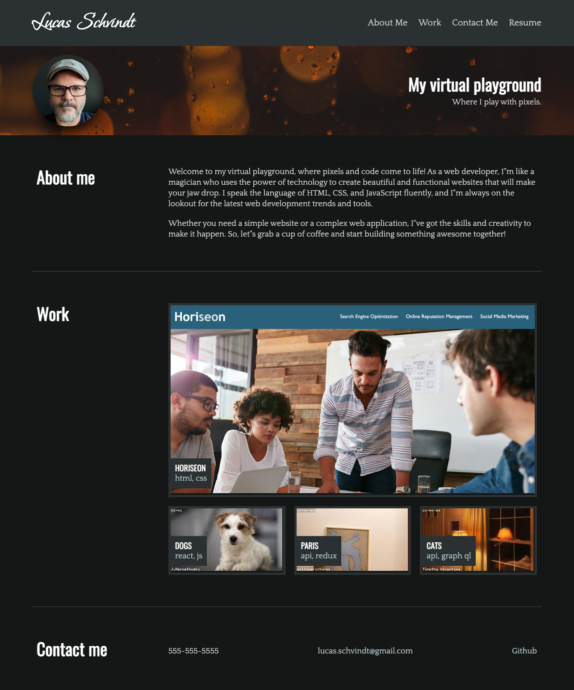
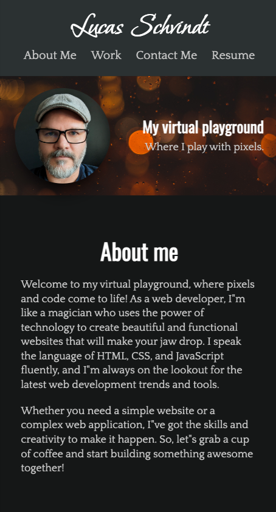

# ADVANCED CSS: Build a portfolio
## Description
Bootcamp week 2 challenge where we create a portfolio to showcase our work to potential employers.
## Installation
N/A
## Usage
Load [this website](https://skywalkah.github.io/advanced-css/) in Chrome and compare visually to requirements. Open Developer tools to look for errors.
## Desktop view

## Mobile view

## Credits
N/A

## License
MIT license - Please refer to the LICENSE in the repo for more info.